# Самодельный стратостат. Полётный план и ОрВД.

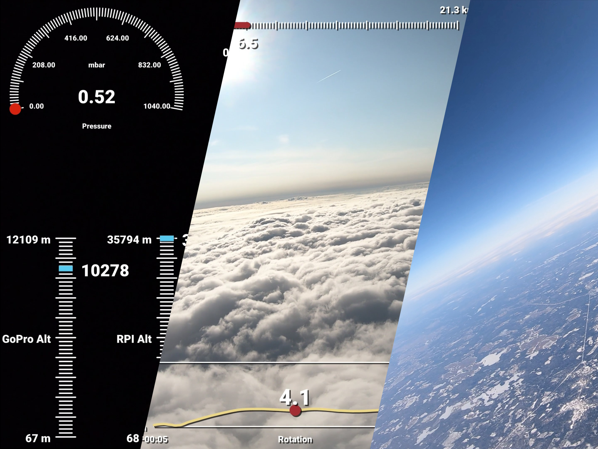

Настало время поговорить про легализацию запусков самодельных стратостатов с целью обеспечения безопасности воздушного движения. Многие считают, что это сложно, вплоть до "невозможно" для обычных граждан, но это не так. Сейчас мы с вами всё быстренько оформим.

## Преамбула

В этом году мы успешно запустили 3 шара, наполненных гелием и отягощенных некоторой полезной нагрузкой в стратосферу. Не все из них долетели, но большинство - долетело. Эта "забава" вызвала, насколько я могу судить, положительную реакцию у читателей: кто-то, вдохновившись, сейчас строит свой стратостат (с роботами и лунопарком, разумеется), кто-то взял на вооружение для детских\подростковых образовательно-развлекательных заведений, а кто-то просто зритель, советник и болельщик. Так или иначе, в воздухе всегда витал один очень важный вопрос, от ответа на который я долгое время уходил. Настало время прояснить давно всех волнующую тему: а как же безопасность полетов?

Если кто-то потерял, то вот вся история/схемы/планы/исходники и ссылки на комплектующие:

[Самодельный стратостат. Часть 1](https://habr.com/ru/post/555070/)

[Самодельный стратостат. Часть 2](https://habr.com/ru/post/577184/)

[Самодельный стратостат. Часть 3](https://habr.com/ru/post/584398/)

## Вводная

Итак, вы решили легализовать и обезопасить ваши стратопуски. Давайте, для начала, обозначим список терминов и аббревиатур, которые нам пригодятся на всём протяжении этого несложного занятия.

**ОрВД** - Организация воздушного движения. Это, собственно, процесс, а не *некая компания*. Сам орган, отвечающий за этот процесс называется [ФГУП "Госкорпорация по ОрВД"](https://ru.wikipedia.org/wiki/%D0%93%D0%BE%D1%81%D0%BA%D0%BE%D1%80%D0%BF%D0%BE%D1%80%D0%B0%D1%86%D0%B8%D1%8F_%D0%BF%D0%BE_%D0%9E%D1%80%D0%92%D0%94). Он и будет выдавать нам разрешение и принимать наш полетный план. Не конкретно этот, а его подразделение, о котором ниже

**ГЦ ЕС ОрВД** - главный центр единой системы организации воздушного движения (далее **ГЦ**). В нашем случае интересен только как *потенциальное пятно контакта с зональным центром*.

**ЗЦ ЕС ОрВД** - собственно, **зональный** центр ОрВД (далее - **ЗЦ**). Именно он будет принимать наши полетные планы и выдавать (или не выдавать) разрешение на использование воздушного пространства (далее - **ВП**).

**Группа ТПП** - группа *тактического планирования полетов*. Группа диспетчеров/диспетчер с которым вам придется держать телефонную связь перед запуском, запрашивать разрешение на запуск и отчитываться о завершении запуска. Самый **важный** контакт в этом деле.

**SHR или СХР** - тип/код полетного плана/сообщения для шаров-зондов. Именно то, что нам надо. Далее будет ясно, где его использовать.

**Приложение от Минтранса с форматом предоставления полетных планов** - [ссылка](https://mintrans.gov.ru/file/397938)

## Общий алгоритм действий

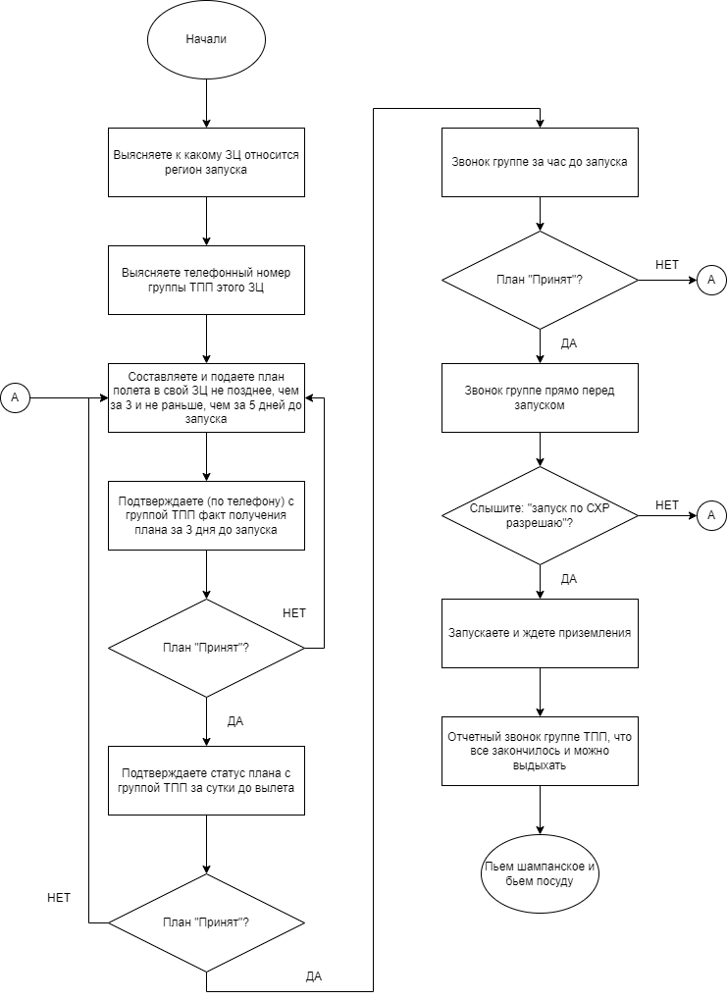

Выглядит сложно, но не сложно. Определение "контактных данных" надо будет сделать лишь единожды для своего региона запуска. Поехали по шагам, я буду делать всё на нашем примере.

### Наводим контакты

1. Определите по [карте](https://gkovd.ru/joint-atm-system/atc-centres-structure/) желаемый зональный центр. В нашем случае это - ЗЦ Санкт-Петербург.
2. Заходим на сайт конкретного ЗЦ, в раздел ["Контакты"](https://sz.gkovd.ru/?page_id=24) и ищем там телефон:
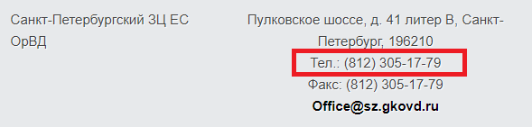
3. Узнаем у них телефон группы ТПП. Прям в трубку и говорите: ало, дайте, пожалуйста, телефон группы ТПП. Для нашего ЗЦ это телефон - **305-17-51**

По контактам это всё. Всё что у вас должно быть на выходе - телефон этой самой группы ТПП. Переходим к регистрации "пилота".

### Регистрация оператора шара-зодна

Заходим на [https://new.ivprf.ru/](https://new.ivprf.ru/) и регистрируемся, указывая **реальные** данные. Этот сайт у них пришел на замену [старому](https://ivprf.ru/), который уже отключен, а этот еще не до конца "включен". Так что возможны проблемы с завершением регистрации (не приходит письмо) и некоторые "нестабильности в работе", но это *терпимо*. На случай проблем с регистрацией они оставили сообщение на основном сайте:

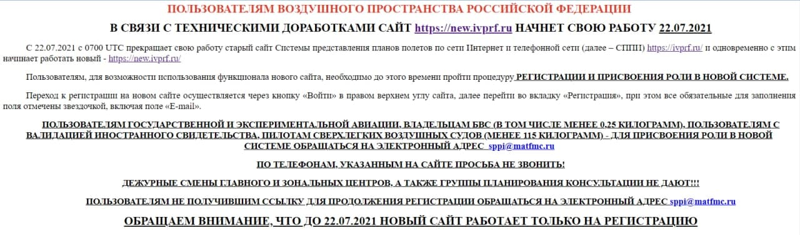

Просто напишите им на sppi@matfmc.ru свой логин и желаемую роль в системе и они всё сделают очень быстро (мне ответили через час, что всё готово). Наша желаемая роль - **Оператор Шара-Зонда**. Остальные роли можете посмотреть там же при регистрации - [https://new.ivprf.ru/](https://new.ivprf.ru/)

Ок, с тех пор, как вы получили данные для входа и присвоенную роль в системе - поздравляю! Вы теперь официально - оператор шара-зонда!

### План полета

У оператора шара зонда не такой уж и большой выбор типов сообщений для составления полетных планов. Это сильно облегчает задачу. Со структурой и вспомогательными функциями сайта я предлагаю ознакомиться самостоятельно, а мы прямо сейчас составим новый план полета.

Идем в раздел **"Воздушные суда"** и нажимаем "Добавить ВС". Это не обязательно, но это слегка автоматизирует заполнение плана в дальнейшем. Нас интересует тип судна - шар-зонд:

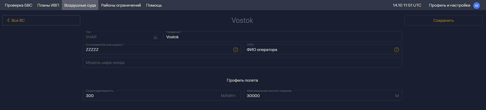

**Название** - любое. Это исключительно для вас.

**Опознавательный индекс** - шары-зонды не подлежат регистрации, так что никакого индекса у них нет. В данном случае применяется стандартная заглушка - буквы "Z". Наш (и ваш, если у вас шар-зонд) опознавательный индекс - **ZZZZZ**

**OPR/** - полное ФИО оператора. Да, под одним аккаунтом можно *насоздавать* ВС с разными операторами. Не знаю, видимо пользуется популярностью. Указываем свое полное ФИО.

**Скороподъемность** - в метрах в минуту! Стандартная скорость подъема такого шара - 5м/с (и мы это даже опытным путем подтвердили). В нашем случае это 300м/мин.

**Максимальная высота подъема** - в метрах. Мы указали 30000м

**Модель шара-зонда** - наш самодельный стратостат моделью не обладает и это поле не обязательное - оставляем пустым. Но кое-какая информация о шаре будет в самом плане.

Всё, больше тут нечего указывать, сохраняем и идем дальше, в **"Планы ИВП"** (ИВП - Использование Воздушного Пространства). Тут нам, операторам шара-зонда, доступен только один тип сообщения - **SHR**:

Нажимаем "Создать". Предложат создать план на карте или "Заполнить форму SHR". На момент описанных событий, карта работала очень не стабильно, так что я предпочитаю заполнить форму SHR. Жмем "Создать план".

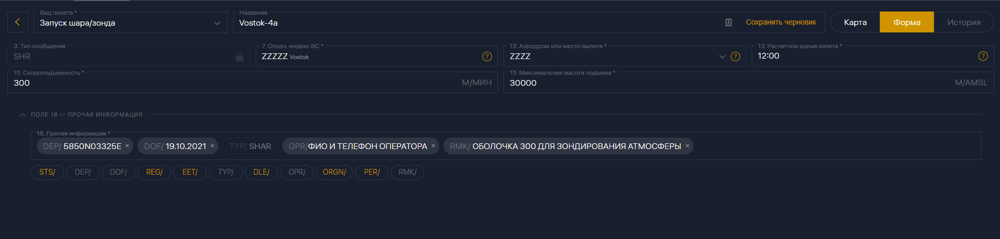

**Вид полета** - доступно несколько (в том числе "Полет БЛА" и "Запуск аэростата"). Каждый вид имеет разные требования к плану. Нас интересует - **"Запуск шара/зонда"**

Сразу можете выбрать из списка **"Опозн. индекс ВС"** недавно созданное судно. Тогда информация о скорости и высоте должна подставиться автоматически (иногда глючит, можно вписать и руками).

**Аэродром или место вылета** - в случае использования стационарного пункта запуска или аэродрома - можете выбрать из списка его. Но это - не наш случай. Мы запускаем по своим координатам, так что в этом поле заглушка - **ZZZZ**

**Расчетное время вылета** - время указывается по **UTC!**. Имейте это ввиду и не пропустите тайминги в своем часовом поясе!

**Скороподъемность** и **Максимальная высота подъема** - так же, как и при создании ВС

Теперь **Прочая информация**. Для нее не создали (возможно *пока*) отдельных полей на форме, так что тут всё указывается через специальные коды.

`DOF/` - Date Of Flight. Дата запуска

`TYP/` - Type или тип ВС. Значение read-only - SHAR

`OPR/` - Operator. Полное ФИО русскими буквами и **контактный** телефон. Важно указать телефон, по которому с вами реально смогут связаться для уточнения деталей и/или изменений плана!

`RMK/` - Remark. Некое примечание. Эта команда не обязательная, но нас попросили указать (дословно): **ОБОЛОЧКА 300 ДЛЯ ЗОНДИРОВАНИЯ АТМОСФЕРЫ**. Почему 300? Я не знаю, а спросить забыли и так всегда и писали. Есть предположение, что 300 - это масса оболочки, но даже когда мы запускали шар L-2000 (массой 2000г), мы всё равно оставляли "как есть". Так же, есть более *вероятная версия* - это **скороподъемность**! И она +/- одинакова для всех наших оболочек.

`DEP/` - Departure. Координаты запуска. Как раз то что надо, если не хотите возиться с аэродромами. Координаты указываются в **градусах и минутах** (можете воспользоваться любым [онлайн сервисом](https://planetcalc.ru/1129/) для перевода из десятичных координат)! Без секунд, без пробелов, без точек/запятых! Значение этого поля должно занимать **строго 11 символов**. Буквы "N" и "E" после широты и долготы - обязательны! Недостающее количество символов заполняется лидирующими нулями. В общем, посмотрите на наш пример на скрине - это реальный план, по которому был произведен запуск и полет.

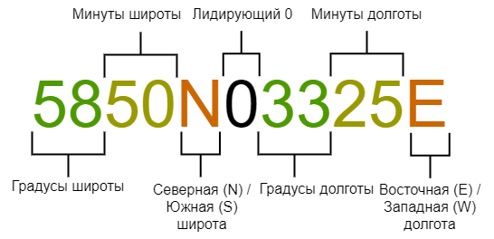

> В интернетах я встречал мнение, что для шара-зонда необходимо указывать сектор/конус/еще_что-то_странное координат направления полета - это, разумеется, не так. Никаких секторов/маршрутов и т.п. от вас не требуется - этим занимается ЗЦ ОрВД! Именно они запрашивают погоду для предоставленного района запуска и времени. И берут на себя ответственность оповещения воздушного движения о наличии шара-зонда в радиусе и по предполагаемому маршруту движения. От вас требуется только **точка запуска**.
>
> Технически, вы можете попробовать этим заняться. Например, используя поле `EET/`, но ЗЦ, скорее всего, попросит вас этим не заниматься :)

Как только всё заполнено и проверено/перепроверено - нажимайте **"Сформировать план"**.

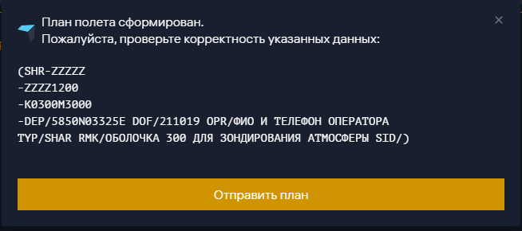

Вот так выглядит готовый полетный план для шара-зонда и в таком виде он уйдет в ЗЦ ЕС ОрВД. Тут можно узнать пару знакомых значений из формы, но какие-то поменялись в угоду летным требованиям. Не важно, если он сформировался - это хороший знак (но еще не 100% гарантия).

Напоминаю, что подать план можно **не ранее чем за 5 дней до запуска**. Если это так - жмите "Отправить план" и выбирайте свой зональный центр. В нашем случае это - ЗЦ ЕС ОрВД Санкт-Петербург. Ваш план, в первую очередь, будет рассматривать именно ЗЦ. Группа ТПП получит его только за 3 дня до запуска (если ЗЦ его примет).

Хочу отметить, что если ваш полет стартует/пересекает *хоть какие-то* города/административные центры/зоны ограничения полетов и т.п. - ЗЦ потребует от вас разрешение на использование воздушного пространства от администрации конкретной зоны (можно выслать им на email). Это лишняя возня и мы её **не проходили**. Мы всегда выбираем места удаленные от всего, тихие и безлюдные. Так что ЗЦ к нам вопросов не имеет. Подобрать себе хорошее место могут помочь следующие ресурсы:

- [Построитель маршрутов для шаров](http://predict.habhub.org/)
- [FPLN](https://fpln.ru/) - поиск закрытых/ограниченных зон, аэропортов/аэродромов, воздушных трасс и всего прочего, чего следует избегать.

> В качестве альтернативы - можете выслать сформированный план на электронную почту ЗЦ (и дальше вести переписку по почте). Почта для СПб ЗЦ: **spbzc@sz.gkovd.ru**

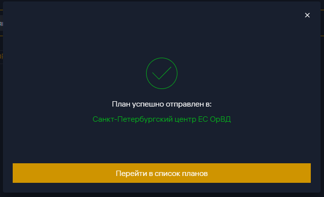

Полдела сделано. ЗЦ должен его получить и присвоить ему некий SID и статус. Сначала он будет "На обработке":

Затем одно из двух:

Или:

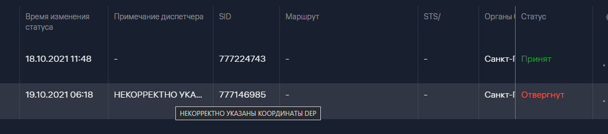

Да, я не просто так уделил особое внимание к полю `DEP/` :)

Что ж, если вы видите у себя картинку, похожую на эту:

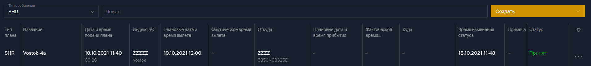

то можно выдохнуть и пару дней *ничего не делать*. Теперь вам надо только **за 3 дня до запуска** позвонить группе ТПП своего ЗЦ (ее телефон мы узнавали в начале) и уточнить у них - всё ли они получили и всё ли хорошо. Бывает так, что не всё хорошо. Система у них новая и работает не идеально. Бывало, что они теряли уже принятые в системе планы. Так что этот шаг **крайне не советую** пропускать.

Далее, по протоколу, надо звонить им же еще за сутки, потом за час до запуска и прямо перед запуском. Но, иногда они говорят: "ладно, за сутки/час не звоните, просто перед запуском позвоните". А потом сами звонят и спрашивают: "всё в силе?" ¯\\_(ツ)_/¯ Так или иначе, дальше по звонкам они вас уже скоординируют. Вам остается только выполнять их указания.

Когда настал час "Ч" (за час/минуту до запуска), у вас уже всё надуто и включено - звоните снова группе ТПП и спрашивайте: "запуск по СХР [там-то там-то] разрешаете?". Ваша задача в этот момент - услышать ключевые слова в ответ: "**разрешаю** использование воздушного пространства по вашей СХР-ке". Поздравляю! Вы совершили зарегистрированный запуск шара-зонда!

Диспетчер группы еще попросит вас связаться с ним, когда шар приземлится. Не забудьте сделать это! Это будет последний доклад в контексте текущего запуска. На этом запуск завершен!

### Подведем итог

Теперь всё суммируем в список шагов:

1. Определили свой ЗЦ
2. Узнали его номер телефона
3. Узнали у ЗЦ номер телефона группы ТПП
4. Составили план
5. Подали его за 5 дней до запуска в свой ЗЦ. Позвонили, уточнили у них: получили или нет
6. За 3 дня до запуска позвонили группе ТПП, узнали: всё ли ок?
7. За сутки до запуска: звонок ТПП. Подтверждение, что все ок
8. За час до запуска: звонок ТПП. Подтверждение, что все ок
9. За минуту до запуска: звонок ТПП. Запрос разрешения на ИВП по СХР
10. Запуск
11. После примезления: звонок ТПП. Отчет об окончании

Вот и всё. Fly safe, cmdr!
